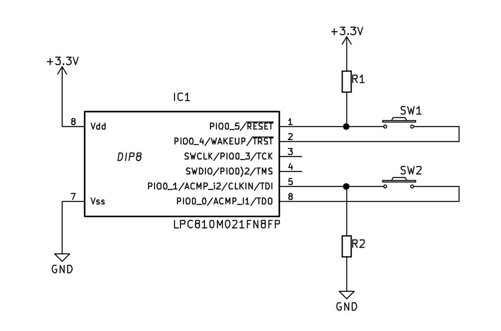
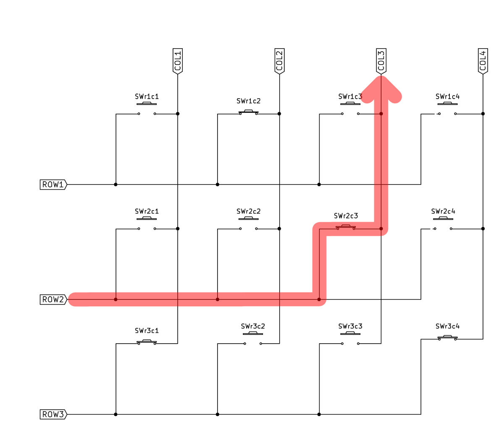
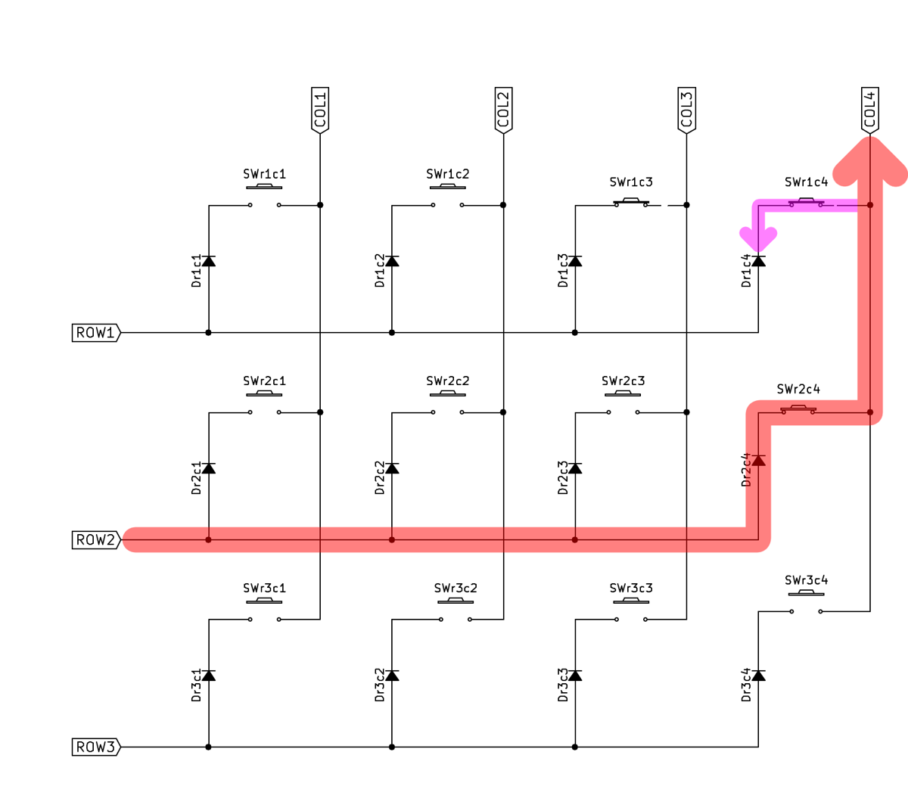
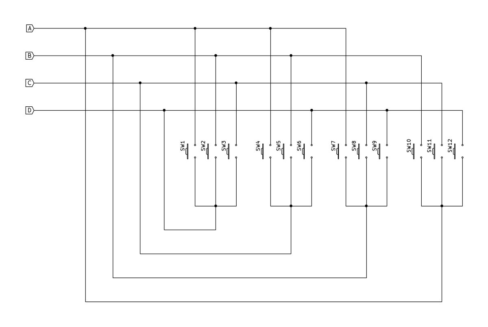
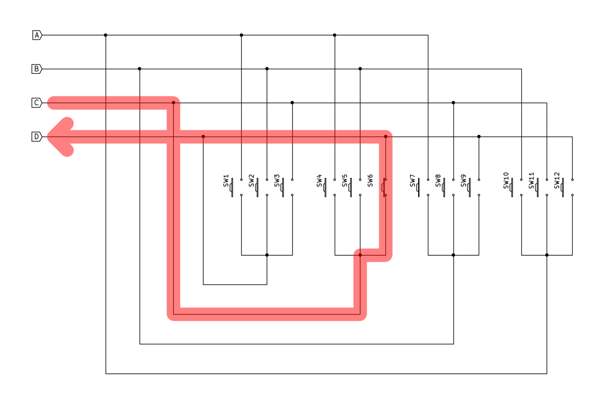
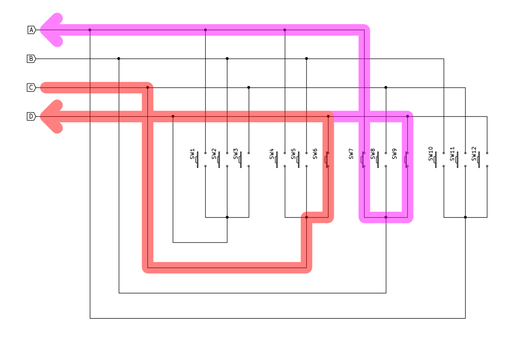
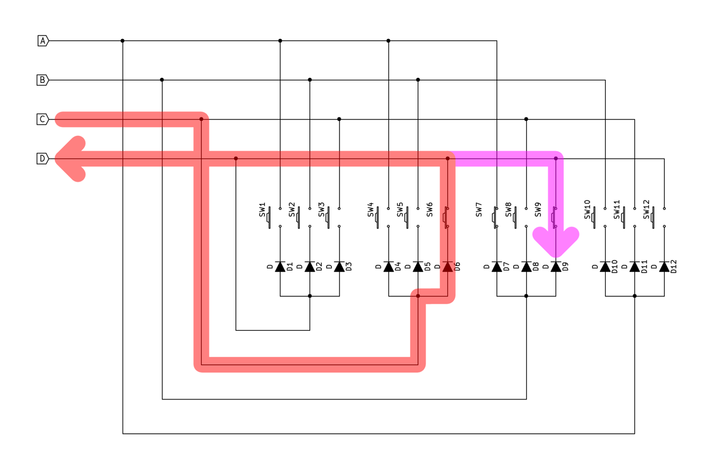
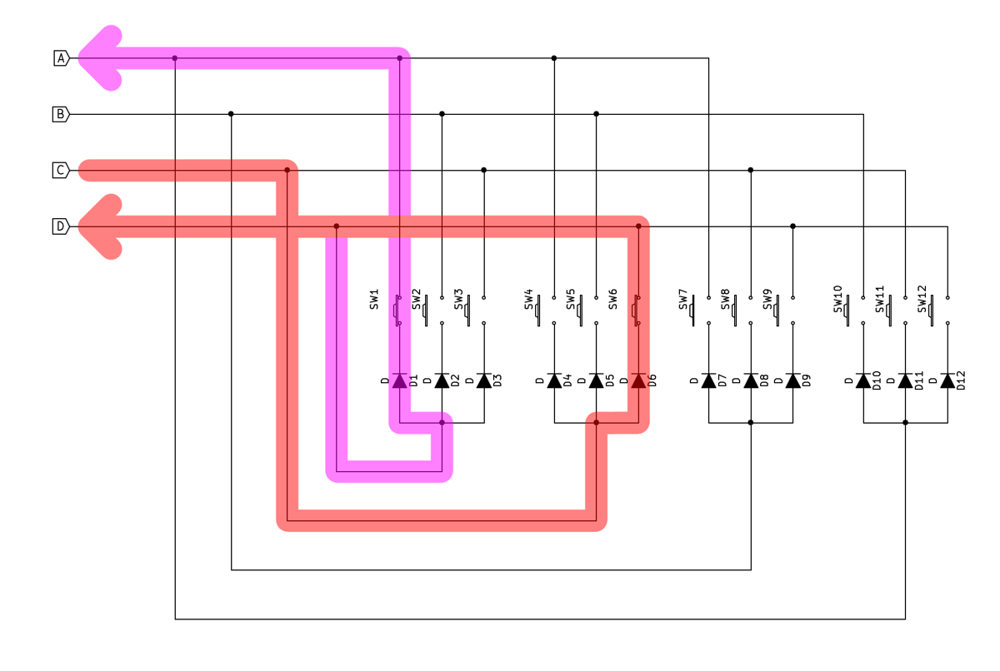

markoplexing: ghostless N*(N-1) switch encoding
===============================================

**markoplexing** is a software extension to the well-known **charlieplexing** method of encoding of __N*(N-1)__ input switches using only **N** I/O ports;  however **markoplexing** distinguishes between real/actual vs spurious/"ghost" switch closures

Contents  
--------
* ["Claimer"](#claimer)
* [Licenses](#licenses)
* [Open Source shout-out](#open_source_shout_out)
* [Background material](#background_material)
    * [MCU switch interfacing](#mcu_switch_interfacing)
    * [MxN switch matrix encoding](#mxn_switch_matrix_encoding)
    * [The "ghost" switch problem](#the_ghost_problem)
    * [The diode fix for ghosting](#the_diode_fix_for_ghosting)
    * [Charlieplexing](#charlieplexing)
* [Markoplexing](#markoplexing)
    * [Debouncing and EMI](#debouncing_and_emi)
    * [Testing](#testing)
    * [Example software implementation](#example_software_implementation)
* [Configurable circuit (matrix/charlieplex)](#configurable_circuit)

"Claimer" 
---------

(As opposed to "disclaimer".)

I claim, at minimum, that I independently conceived the technique contained herein. Therefore, in time-honored tradition, I am naming it after myself.

I have searched online, on multiple occasions between September 2017 and the present date of February 5, 2019, without finding any mention of the technique; surprising given its simplicity. I am, however, aware that users of the largely broken patent and intellectual property systems often engage in the practice of "hiding" their work in order to better position themselves to instigate legal action.

If presented with verifiable evidence of prior significant public disclosure of the technique, I will gladly share or cede credit with/to prior discoverers. This includes changing the name chosen here, to the extent practical. Likewise, I will somewhat less gladly comply with any legal claims of patent or intellectual property infringement, again to the extent practical; for example, even if removed in the future it would not be possible to retroactively change the fact that this repository was once available and may have been accessed.

I believe the technique may be of use to practitioners in its field, and am therefore distributing it, but WITHOUT ANY WARRANTY; without even the implied warranty of MERCHANTABILITY or FITNESS FOR A PARTICULAR PURPOSE, under the terms of the [licenses](#licenses), below.

Licenses  
--------

This README.md document and machine-generated versions thereof, and the technique(s) it describes, is/are licensed under the terms of the Creative Commons [Attribution-ShareAlike 4.0 International](LICENSE_cc-by-sa.txt), also available at <https://creativecommons.org/licenses/by-sa/4.0/>.

The software contained in this repository is licensed under the terms of the [GNU General Public License](LICENSE_GPL.txt), also available at <https://www.gnu.org/licenses/gpl.html>.

### Open Source shout-out 

All circuit diagrams were designed with Kicad/eeschema.

All images were exported from Kicad/eeschema and edited (graphic lines and arrows added) using GIMP (and the ArrowCurved plugin).

The physical circuit board was designed with Kicad/pcbnew.

The example software implementation source code was written using GNU Emacs and compiled with the GCC ARM compiler.

This README.md was written using GNU Emacs and tested with Discount/Markdown.

Background material 
-------------------

This section contains background explanations of microcontroller (MCU) switch interfacing, switch matrix encoding, and charlieplexing.

Those familiar with MCU switch interfacing should skip ahead to [MxN switch matrix encoding](#mxn_switch_matrix_encoding)

Those familiar with charlieplexing should skip ahead to [Markoplexing](#markoplexing)

Those understandably annoyed at being told what skip should skip this entire repository. Note, however, that this is the last of the "skip" suggestions.

### MCU switch interfacing

Physical switches are normally interfaced (connected) to microcontrollers and similar ICs using one of two slightly different methods.

Since unconnected MCU input ports are subject to random electrical noise which can cause false readings, switches are usually connected in such a way that their associated input port is always in a known state regardless of whether the switch is open or closed.

The two methods are:

1. Logic *low==true*: The input port is connected to the positive voltage supply through a "pull up" resistor. The switch is also connected  to the port, and when closed shorts it to ground. (The resistor prevents excess current flow.) When the switch is open the input port reads as *high*, and when closed *low*.

2. Logic *high==true*: The input port is connected to the ground through a "pull down" resistor. The switch is also connected  to the port, and when closed shorts it to the positive voltage supply. (Again the resistor prevents excess current flow.) When the switch is open the input port reads as *low*, and when closed *high*.

Note that in both cases the resistors may be external, or internal to the MCU and enabled or disabled via software.

The following figure illustrates a variation of these methods, in which instead of the switch being connected to power or ground it is connected to a separate MCU output port which provides the appropriate "switch open" voltage level. If that voltage is output, the switch input behaves as described above. If it is not -- the output port is disabled to a high impedance state -- the switch has no effect; however the input port remains in its known state via the pull-up/-down resistor.

This method is not necessary (though it is still usable) for singly-connected switches. It is important for use with the switch matrix encoding schemes described below because it allows enabling and disabling the switches.

##### Logic==high in all examples 
Note that all examples in this README.md, and all code in this repository, assume high==true / pull-down resistors. The opposite could be used equally well, but would require reversing the polarity of the diodes in the circuit diagrams below.

### MxN switch matrix encoding

Normally, interfacing **N** switches to a microcontroller would require **N** MCU input ports. While this is practical for small numbers of switches, it becomes unworkable as **N** becomes large.

A common technique for interfacing large numbers of switches (such as a numeric keypad or particularly a PC keyboard) is to arrange **M*N** switches in a **MxN** rectangular matrix. In this way the **M*N** switches can be interfaced using only **M+N** I/O ports.

Note that to get the greatest benefits from this scheme, **M** and **N** should be approximately equal, i.e. the rectangular matrix should be as square 
as possible. For example, 100 switches may be arranged in the following matrices:

         M      N       M*N     M+N       100-(M+N)      extras         
         -     ---      ---     ---       ---------      ------
         1     100      100     101           -1      
         2      50      100      52           48      
         3      34      100      37           63            2
         4      25      100      29           71      
         5      20      100      25           75      
         6      18      100      24           76            8
         7      15      100      22           78            5
         8      13      100      21           79            4
         9      12      100      21           79            8
        10      10      100      20           80

The best benefit (80 fewer I/O ports) is achieved with the 10x10 matrix.

Note also that the topological connections of the matrix need not match the physical layout/geometry of the switches.

The following figure illustrates a 3x4 **MxN** matrix encoding for the common 12-key numeric keypad.

### Scanning

Matrix-encoded switches are read by MCU software using a *scanning* technique. The rows of the matrix are connected to MCU output ports, and the columns to input ports. (Note that the distinction between "rows" and "columns" is arbitrary -- either dimension may be assigned arbitrarily as long as the assignments are consistent.)

Scanning proceeds as follows:

1. All row outputs are initialized to inactive, high-impedance state.
2. Each row in turn is "energized" (set to high or low level, depending on the "logic true" level, pull-up/-down convention chosen; see [above](#all_examples_logic_high_true))
3. The states of the input ports are read. By correlating which row is energized with which input ports are "true", the subset of switches which are closed is uniquely known.
4. The row output is de-energized.
5. Steps 2 through 4 are repeated until all rows have been energized, and all switch closures detected.

One step of the scanning process is illustrated in the following figure.  At the time shown, Row 2 is energized, which in combination with switch r2c3 ("row 2, column 3") being closed causes the Column 3 input port to read "true" while Columns 1, 2, and 4 read "false". Note that the closed states of switches r1c2, r3c1, and r3c4 have no effect as only Row 2 is energized. The red arrow line shows current flow from the Row 2 output to the Column 3 input.

Multiple closed switches in the same row are read similarly. In example below, Row 3 is energized and the closed switches r3c1 and r3c4 are simultaneously read on inputs Column 1 and Column 4

### The "ghost" switch problem 

Unfortunately, matrix switch encoding has a significant flaw. If certain combinations of switches are closed simultaneously, the technique will spuriously read one or more *open* switches as closed.

The following figure illustrates the problem. Switches r1c3, r1c4, and r2c4 are closed. When Row 1 is energized (not illustrated), switches r1c3 and r1c4 are correctly read on input ports Column 3 and Column 4.

However, when Row 2 is energized as shown, current flows through switch r2c4 and is correctly detected at input port Column 4. But the current also flows "backwards" through switch r1c4 to row1, and from there through switch r1c3 to the Column 3 input port, as shown by the magenta arrow line.

This causes the scanning software algorithm to falsely read switch r2c3 as closed when in fact it is not. This is  colloquially known as a "ghost" switch closure because it as if some supernatural entity has closed the switch.

### The diode fix for ghosting 

Fortunately, there is a simple fix for the "ghost" switch problem, although it requires additional hardware. By adding a diode in series with each switch,  the "backward" current flow is stopped. The figure below is identical to the one above except for the additional diodes. The magenta arrow line shows current being prevented from flowing through switch r1c4 to Row 1, and switch r2c3 is not read as a ghost closure.

### Charlieplexing

"Charlieplexing" is a very clever scheme which allows interfacing **N*(N-1)** switches using only **N** I/O lines -- typically far fewer than required by **MxN** matrix encoding. Note that the "I/O lines" distinction is important: In charlieplexing, ports must be dynamically switchable, sometimes being configured as inputs and other times as output.

A charlieplexed circuit for 12 switches interfaced with 4 lines (`4*(4-3)==12`) is shown below. The circuit is best understood as having each of the I/O ports -- when temporarily configured as an output -- connected to 3 switches. The other sides of the switches are connected to one of the remaining 3 I/O ports, each of which is simultaneously/temporarily configured as an input.

Scanning is similar to the MxN matrix algorithm:

1. All ports are configured as inputs
2. Each port in turn configured as an output and "energized"  (set to high or low level, depending on the "logic true" level, pull-up/-down convention chosen; see [above](#all_examples_logic_high_true)).
3. The remaining ports are read.  By correlating which port is the energized output with which input ports are "true", the subset of switches which are closed is uniquely known.
4. The output port is de-energized and returned to "input" configuration.
5. Steps 2 through 4 are repeated until all ports have been output-energized, and all switch closures detected.

The following figure shows scanning with port C configured as an output, and port D reading the switch 6 closure as an input

Similar to MxN matrices, multiple charlieplexed switches can be closed simultaneously and (sometimes! -- see below) correctly read. In the following figure, switches 4 and 6 are closed.

However, charlieplexing also suffers from ghost switch problems. The following figure shows current flowing from output port C, through switch 6, and being  correctly detected at input port D. But since the switch 6 closure energizes the port D line, current flows "backwards" through closed switch 9, and then through switch 7 to input port A, just as it does when port D is intentionally energized and reading switch 1 of the 1-through-3 group. There is no way for port A to "know" the difference between this and the case where switch 4 is closed together with switch 6 as illustrated [above](#charlieplex_4_and_6), and switch 4 is read as a "ghost" closure.

As with MxN matrices, diodes can be added to prevent the backward flow and ghost switch misreads. The figure below illustrates this, with the flow through switch 9 being prevented by its associated diode, and the switch-7-misread-as-ghost-switch-4 error avoided.

But a significant problem remains. The following figure illustrates a different kind of ghosting. Again, current flows correctly from output port C, through switch 6, and is detected at input port D. Also again, this energizes the port D line and current flows through switch 1 to input port A causing switch 4 to be falsely read as a ghost closure.

But as opposed to the situation with MxN matrices, where diodes fixed all ghosting problems, in charlieplexing they only prevent some "ghosts". In the above example (among others), the incorrect current flow through switch 1 is in the "correct" direction, just as it would be when port D is energized to read switches 1 through 3. The following shows how the current passes through the diode to then be read incorrectly at port A.

This is the fatal flaw of the charlieplexing technique. (Note it is "fatal" only if multiple switch closures need to be detected correctly and ghosts ignored. If a system can only have one switch closed at a time, or is allowed to reject cases when multiple switches are read as closed, correctly or not, the flaw is unimportant.)

But if any/all combinations of multiple switches must be detected correctly (without ghosts), charlieplexing -- and its benefit of reduced I/O port count -- cannot be used. There is no way around the ghosting problem.

*Or is there?*

Markoplexing 
----------------------------------------

"Markoplexing" (see ["Claimer"](#claimer), above) is a very simple idea which distinguishes between real and ghost charlieplex switch closures. It is a software-only technique which requires no changes to the (diode-enhanced) charlieplex circuit topologies. This is achieved as follows ...

Observe that the two current flows, one correct and one "ghost", in the final circuit diagram [above](#charlieplex_fatal). The correct one goes through diode 6 (and switch 6). The ghost current flows goes diode 6 ... *and* diode 1.

The correct input port sees the output port's voltage minus one diode voltage drop. The incorrect/ghost port sees **two** diode drops.

*A-ha!* What if, rather than configuring and reading the ports a digital inputs, true/false, one/zero, they are configured and read as *analog* inputs?  The difference between the voltage levels in the correct and ghost cases can then be detected, and latter rejected.

*Charlieplex ghosting fixed!*

Note that this technique has several requirements:

* A microcontroller with either ADC or analog comparator inputs
* ... which can be dynamically switched between analog input and digital output modes
* Correct configuration of the analog voltage threshold between one vs more than one diode voltage drop
* ... diode voltage drops which, due to the very low currents allowed by the high input impedance of the input ports is *not* the canonically-spec'd value (typically 0.7V))

Note also that, as tempting as it may seem, it is probably impossible to discriminate between the one and multiple diode voltage drops using a digital input port. Digital input ports always have thresholds for the detection of high and low logic levels, with an "undefined" voltage zone in between.

These levels are typically `0.3Vdd`, below which a logic 0 is read, and `0.7Vdd` above which is logic 1. There is no mathematically possible forward diode voltage drop `Vf` which simultaneously satisfies the two required inequalities:

        Vdd -  Vf > 0.7Vdd
        Vdd - 2Vf < 0.3Vdd

Despite this, the required analog threshold can be adjusted by appropriate choice of diode, including Schottky for low Vf and light-emitting (LED) for high Vf.

### Debouncing and EMI 

Switch debouncing -- ignoring the very rapid (sub-millisecond) opening and closing of switches due to their mechanical construction -- is outside the scope of this repository. However, it may be possible to add capacitors to the switches to reduce switch closure rise time. Additionally, it may be possible to "ramp up" the output port voltage by using analog instead of digital outputs, which may in turn reduce edge-induced EMI caused by scanning. Both of these techniques could be used with digital inputs, but better results might be obtained with the analog input technique, particularly if the input ports have configurable hysteresis.

### Testing 

The "markoplexing" technique presented here is not merely a theoretical concept -- it has been tested (and works as described) in a real-world demonstration.

A 12-switch charlieplex circuit was constructed and tested using the markoplex technique. All 4096 possible switch combinations have not been checked; those are far too many for manual testing and I have not had the time or resources to construct a testbed using solenoids, relays, transistors, opto-isolators, CMOS analog switches, etc. to automate the process.

However, many multiple-closed-switch combinations *were* tested. All exhibited ghosting with charlieplex software (as expected), and none with markoplex. More conclusively, all 12 possible permutations of "all switches closed except for one left open" were checked -- if anything would produce ghosting those
would (but with markoplexing did not).

### Example software implementation 

Included here is an example software implementation for the NXP LPC824 microcontroller chip. Both a charlieplexing and a markoplexing executable can be built to better compare the original and modified techniques.

Also included is a primitive standalone build system for compiling the executables. Most users will probably want to extract only the basic code (contained in the [source](source) directory) for use in their own build environments.

Basic constants describing I/O port (thus physical MCU pin) assignments, etc (many "etceteras") are contained [main.c](source/main.c), [markoplex.c](source/markoplex.c),  and [display.c](source/display.c) source files. A differently connected LPC824 would require changing these. Of course a different MCU would require a complete rewrite of the code which, in the interest of simplicity, is written in C and without any attempt a making it generic and portable.

If a 12 LED APA102 "smart" RGB strip is available it can be connected and driven by the LPC824's SPI peripheral to display the detected switch closures (actual and/or ghost). See the file [display.c](source/display.c) and the `#ifdef USE_DISPLAY` conditional compilation directive. If not, the included `markcharl.gdb` file's "dprintf" command can be used instead (or in addition).

The `#ifdef SWITCHABLE_KEYPAD` configuration is for use with the [circuit](#configurable_circuit), below.

Configurable circuit (matrix/charlieplex) <a name="configurable_circuit"</a>
----------------------------------------

As an extra added bonus for the first 100 users to clone or download this repository (as well as any and all others -- I have no intention of removing the circuit; I just like the sound of the marketing phrase "for the first 100") will receive, free of charge, the following circuit diagram which can be configured via jumpers into either a 3x4 matrix or a 12-key/4-port charlieplex arrangement.

The three 4-position headers shown as all jumpered represent an incorrect configuration. (I didn't know how to draw headers/jumpers differently.) To use the circuit as a 3x4 matrix, connect the middle two pins (#2 and #3) of each of the three headers.

To use it as for 12-key/4-port charlieplexing/markoplexing, connect the outer sets of pins (#1 to #2 and #3 to #4) on each header, and connect Columns 1 through 4 to the four I/O ports. (The Row 1 through 3 connections are unused in this configuration.) The switch numbers in this diagram map to the ones in the charlieplex diagrams above as:

        configurable    charlieplex
        ------------    -----------
          Col1              D
          Col2              A
          Col3              B
          Col4              C

          r1c2             sw1  A
          r1c3             sw2  B
          r1c3             sw3  C

          r2c1             sw12 D
          r2c3             sw10 B
          r2c4             sw11 C

          r3c1             sw9  D
          r3c2             sw7  A
          r3c4             sw8  C

          r1c1             sw6  D
          r2c2             sw4  A
          r3c3             sw5  B

This should be (somewhat) clear from tracing the circuit.

Enjoy!

